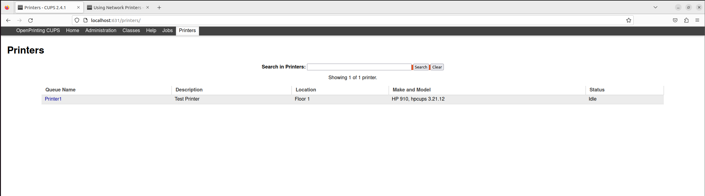

# KEST2NL05EU LOKAVERKEFNI
**1. Install and configure the server1, client1 and client2 with hostnames and domain as ddp.is**

Ég gerði svo það sama fyrir Client 1 og 2

**2. configure server1 with static IP Address, from the IP Address block 192.168.100.0/24. The server must be configured with the 10th usable IP Address.**

**4. Install and configure DNS server on server1, so Hostnames are resolved to IP Addresses.**

**5. Create the users accounts using a script, see the Users file.**

**7. Due to data loss the company policy requires taking backups weekly, as system engineer
you are required to schedule backups of home directories to run weekly at midnight each
Friday**

**8. Install and configure NTP on the server and clients, server1 must be master server to
synchronize the time of the clients**

**10. Install and configure Postfix on server1, so users can send and receive emails using Round
Cube open-source software.**

**11. Install and configure shared printers for each group, only users that belong to the group
should print only, accept IT and Management groups should print and manage the printers.**

